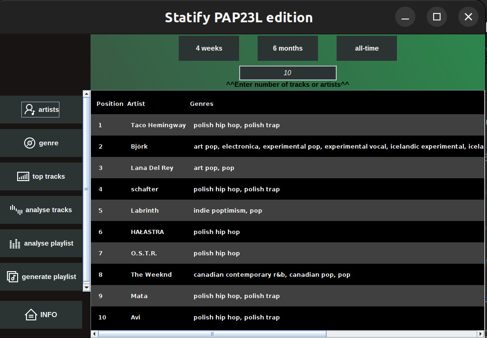
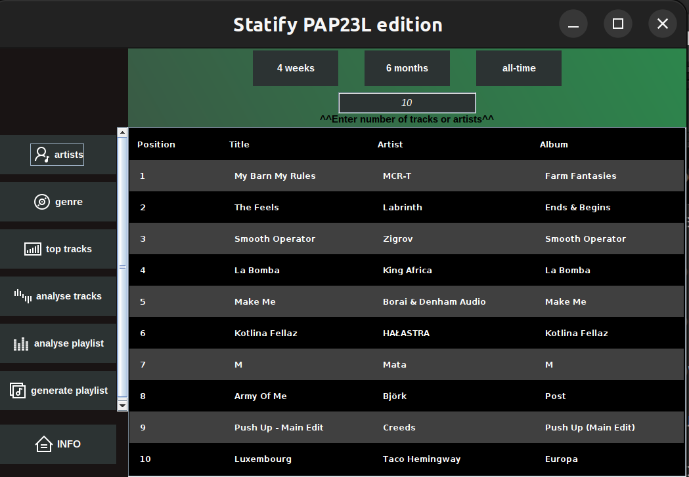
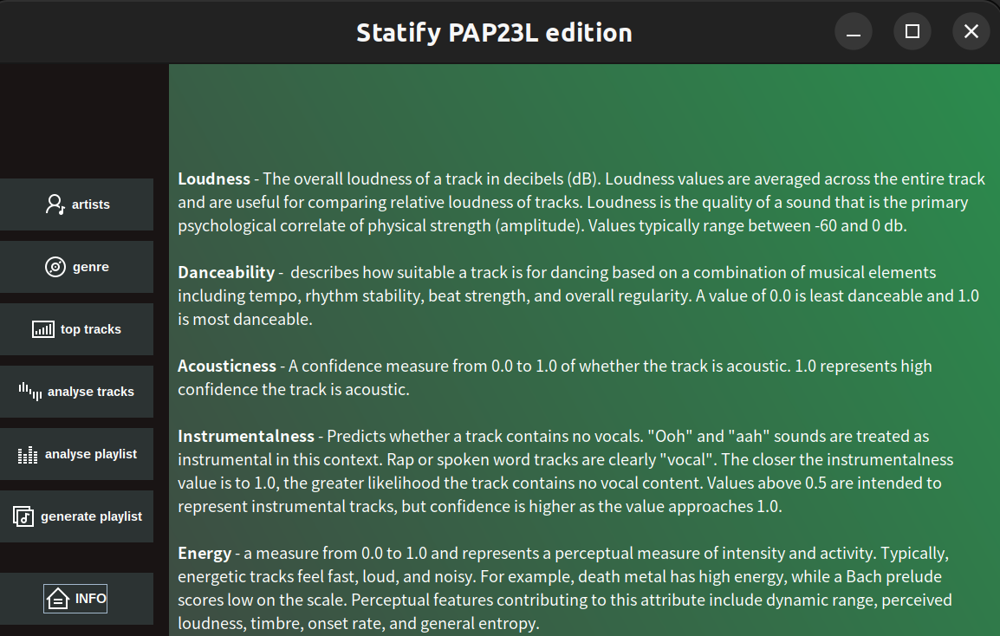
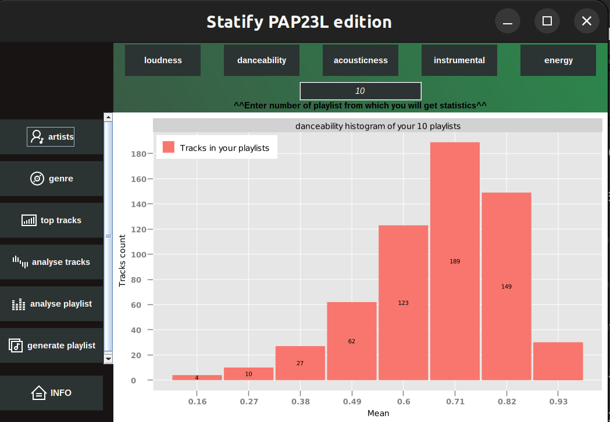
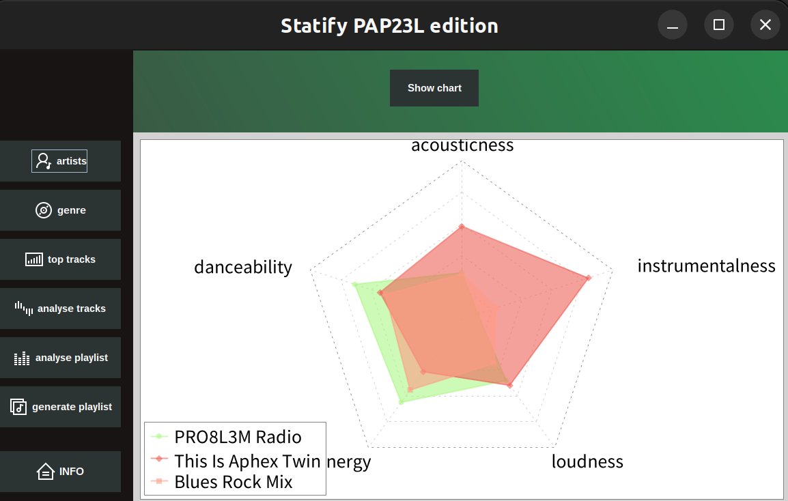
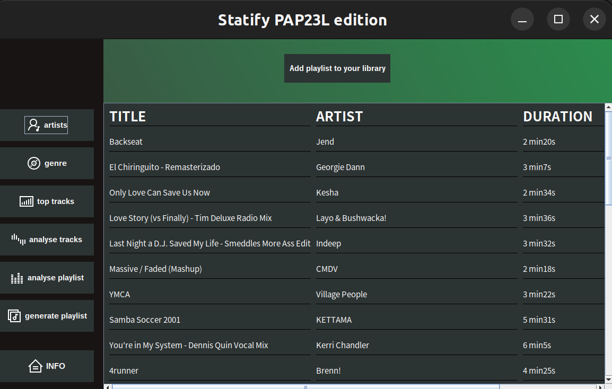

# PAP Projekt → Statify
Prosta aplikacja desktopowa umożliwiająca przeanalizowanie statystyk odsłuchań z twojego konta na Spotify

## Wymagania systemowe

Ubuntu 22

zainstalowany ChromeDriver 113.0.5672.126

    $sudo apt update

    $sudo apt-get install chromium-chromedriver

## Uruchomienie
Aby uruchomić aplikację należy uruchomić plik pod nazwą 'App.java', wtedy nastąpi przekierowanie do zalogowania się do Spotify.
Alternatywną opcją jest uruchomienie pliku 'LoginWinow.java', jednak wtedy trzeba uzyskać AccessToken Spotify.

## Autoryzacja Użytkownika
Po uruchomieniu aplikacji użytkownik zostaje poproszony o zalogowanie się do swojego konta Spotify. Po udanej autoryzacji otwiera się główne okno programu

## Funkcjonalność:

### TopArtist - Twoi ulubieni artyści
Po wybraniu liczby utworów i okresu czasu, użytkownik może przejrzeć listę najczęściej słuchanych przez niego utworów w danym okresie.

### Top Tracks - najchętniej słuchane utwory
Analogicznie użytkownik może przeanalizować swoje ulubione utowory z różnych okresów czasu.

## Analiza paramterów
Każdy utwór na Spotify posiada specyficzne parametry, których watość określa charakter i brzmienie utworu. Statify pozwala przeanalizować swojąbibliotekę pod kątem tych parametrów. Ich szczegółowe opisy znajdują się pod przyciskiem INFO

 
### Analizowanie utworów
Po wybraniu liczby playlist z bibioteki użytkownika, które mają być przeanalizowane, generowany jest histogram wybranego parametru. Z histogramu można odczytać jak rozkładają się wartości parametrów na wybranej utworów z naszej biblioteki.

### Analizowanie wybranych playlist
Po wybraniu maksymalnie pięciu playlist z biblioteki użytkownika, pojawia się wykres radarowy który umożliwia porównanie parametrów pomiędzy playlistami, oraz jakie cechy dominują w danej playliscie.

### Analiza statystyk

- analiza najczęściej słuchanych artystów, top piosenek użytkownika
- badanie playlist użytkownika wg m.in. średniej wartości “loudness”, “tempo”, “danceabilty”, gatunków etc.
- analiza danego autora na podstawie jego najpopularniejszych utworów i ich parametrów takich jak np. “liveness”, “energy”, “intrumentalness” itd.

### Kreator Playlist
Na podstawie ulubionych artystów, lub utworów z wybranego okresu czasu użytkownik może wygenerować recomendowaną playlistę.

## Technologie i źródła:
- Java
- [Api Spotify](https://developer.spotify.com/documentation/web-api/reference/#/)
- [Spotify api Java wrapper]( https://github.com/spotify-web-api-java/spotify-web-api-java)

### Pozostałe źródła:
ikony: https://icons8.com/icon/set/music/windows--static

### Autorzy:

Miłosz Kowalewski 

Julia Macuga

Filip Szczygielski

Mikołaj Wewiór
